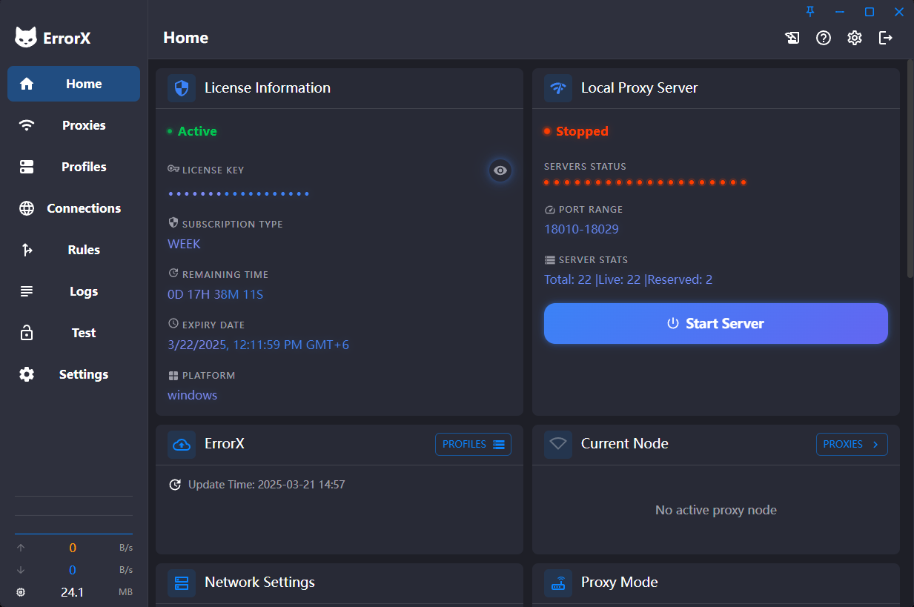

# <h1 align="center">
  
  <br>
  Continuation of <a href="https://github.com/zzzgydi/clash-verge">Clash Verge</a>
  <br>
</h1>

<h3 align="center">
A Clash Meta GUI based on <a href="https://github.com/tauri-apps/tauri">Tauri</a>.
</h3>

## Preview

| Dark                             | Light                             |
| -------------------------------- | --------------------------------- |
|  |  |

## Install

Go to the [release page](https://github.com/clash-verge-rev/clash-verge-rev/releases) to download the corresponding installation package.
Supports Windows (x64/x86), Linux (x64/arm64) and macOS 10.15+ (intel/apple).

### For installation instructions and FAQ, please visit the [documentation page](https://clash-verge-rev.github.io/): [Doc](https://clash-verge-rev.github.io/)

---

### Telegram Channel: [@clash_verge_rev](https://t.me/clash_verge_re)

## Promotion

[DoggyGo VPN — Technical VPN Service](https://verge.dginv.click/#/register?code=oaxsAGo6)

- High-performance VPN service with free trial, promotional packages, streaming media unblocking, and first global support for Hysteria protocol
- Register with Clash Verge exclusive invitation link for 3 days free trial with 1GB daily traffic: [Register Here](https://verge.dginv.click/#/register?code=oaxsAGo6)
- Clash Verge exclusive 20% discount code: verge20 (limited to 500 uses)
- Promotional package starts at $2.20/month, 160GB traffic, additional 20% off for annual subscription
- Overseas team management, high commission rates up to 50%
- Cluster load balancing design, high-speed dedicated lines (backward compatible), ultra-low latency, peak hour resistant, 4K instant streaming
- First global VPN service with Hysteria protocol, now featuring the faster `Hysteria2` protocol (Best paired with Clash Verge client)
- Unlocks streaming services and ChatGPT
- Official website: [DoggyGo.com](https://verge.dginv.click/#/register?code=oaxsAGo6)

## Features

- Built with powerful Rust and Tauri 2 framework
- Built-in [Clash.Meta(mihomo)](https://github.com/MetaCubeX/mihomo) kernel with support for `Alpha` version kernel switching
- Clean and beautiful user interface with customizable theme colors, proxy group/tray icons, and `CSS Injection`
- Configuration file management and enhancement (Merge and Script), configuration file syntax hints
- System proxy and guard, `TUN(virtual network card)` mode
- Visual node and rule editing
- WebDav configuration backup and sync

### FAQ

Refer to [Doc FAQ Page](https://clash-verge-rev.github.io/faq/windows.html)

### Donation

[Support Clash Verge Rev Development](https://github.com/sponsors/clash-verge-rev)

## Development

See [CONTRIBUTING.md](./CONTRIBUTING.md) for more details.

To run the development server, execute the following commands after all prerequisites for **Tauri** are installed:

```shell
pnpm i
pnpm run check
pnpm dev
```

## Contributions

Issue and PR welcome!

## Acknowledgement

Clash Verge rev was based on or inspired by these projects and so on:

- [zzzgydi/clash-verge](https://github.com/zzzgydi/clash-verge): A Clash GUI based on tauri. Supports Windows, macOS and Linux.
- [tauri-apps/tauri](https://github.com/tauri-apps/tauri): Build smaller, faster, and more secure desktop applications with a web frontend.
- [Dreamacro/clash](https://github.com/Dreamacro/clash): A rule-based tunnel in Go.
- [MetaCubeX/mihomo](https://github.com/MetaCubeX/mihomo): A rule-based tunnel in Go.
- [Fndroid/clash_for_windows_pkg](https://github.com/Fndroid/clash_for_windows_pkg): A Windows/macOS GUI based on Clash.
- [vitejs/vite](https://github.com/vitejs/vite): Next generation frontend tooling. It's fast!

## License

GPL-3.0 License. See [License here](./LICENSE) for details.
